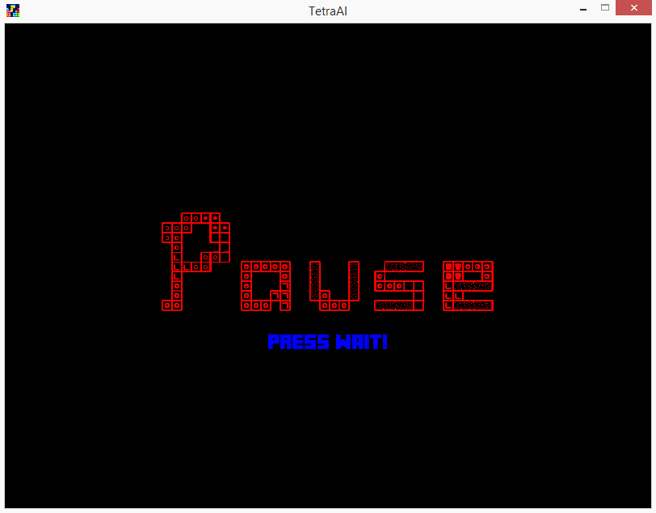

TetraAI
========================================
Creating a tetris AI that plays Tetris.\
**Made by Zain Cheema.**
----------------------------------------
#### -> Data at time of first push onto github: `14/12/2019`
#### -> Data of project first created: `23/10/19`
#### -> Data when project is completed: `05/04/2020`
##### Read "`requirements.txt`" for what modules are necessary to run the program
*Thank you very much! Arigato Gozaimasu*


###### Project is now completed!

__Update log:__

```python
Update #1 (14/12/2019): First push on to git! Currently at 30 - 40%ish. Main game source found at: *Tetra.py*
Update #2 (15/12/2019): Second and mini push! 183 additions and 45 deletions!
Update #3 (29/02/2020): Third/Forth push! 1,346 additions and 431 deletions!
Update #4 (05/04/2020): Fifth Push! 289 additions and 50 deletions! The program is
```
### **Completed Updated!**

We have final reached our conclusion. I have completed the program. The true OOP Tetris AI Code.
So, finally that this project is completed, I will soon or later upload my writeup for this project.
It's been about 6 months in the working this project with the first two months being me brainstorming 
how to make this program function!
Now that we come to the end of this program, I can say it's been quite an adventure with lots and lots
of debugging!
But I still will update this program in terms of bug fixes. Otherwise this project is completed!

***Tetra AI was completed on 05/04/2020***

#### __Current look of program:__

*Title Screen*


*Game Screen*


*Pause Screen*


*Game Over Screen*


*Graph Screen*


**Project Contains**

- [x] **`test_tetra`** # *The folder contains all the screenshots of the program leading up to it's current state*
- [x] **`fonts, images`** # *Folder containing all the fonts and images for the program*
- [x] **`.gitignore`** # *File retaining ignored temp files*
- [x] **`Tetra_Pieces.py`** # *Module for Tetra.py which holds the tetromino structure*

**New Additions**

- [x] **AI** # Add AI to `tetra.py` now we have the power of AI!
- [x] **Project is completed!** # Yeah we done


Debugging and making ruff ideas on how all these work was complicated!\
**To do list**:
- [ ] Bug fixes if any
