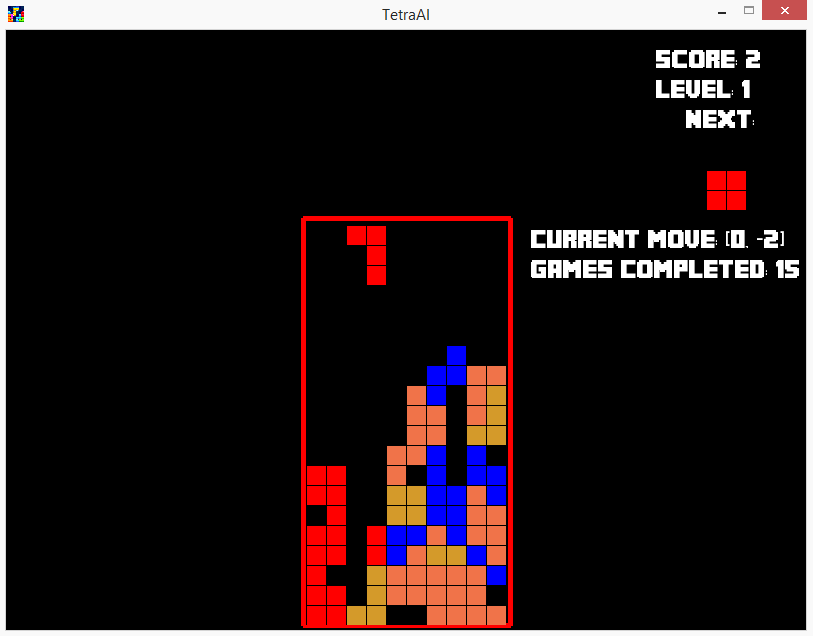
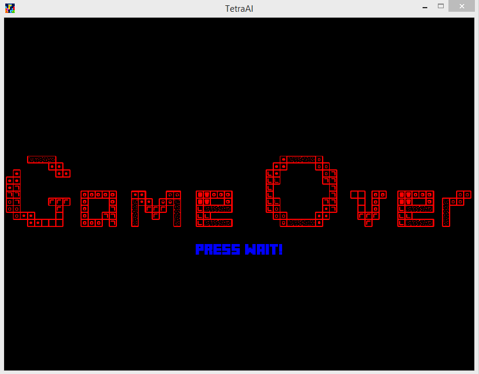

TetraAI
========================================
Creating a tetris AI that plays Tetris.\
**Made by Zain Cheema.**
----------------------------------------
#### -> Data at time of first push onto github: `14/12/2019`
#### -> Data of project first created: `23/10/19`
#### -> Data when project is completed: TBA
##### Read "`requirements.txt`" for what modules are necessary to run the program
*Thank you very much! Arigato Gozaimasu*


###### Project is now 80% of the way complete, all that is left is the AI

__Update log:__

```python
Update #1 (14/12/2019): First push on to git! Currently at 30 - 40%ish. Main game source found at: *Tetra.py*
Update #2 (15/12/2019): Second and mini push! 183 Additions and 45 deletions!
Update #3 (29/02/2020): Third/Forth push! 1,346 additions and 431 deletions!
```
### **Rehaul Update**

Everything has been completely rehauled, I have pretty much for the past 3 months.
Reworked from scratch, and finally I have completed about 80% of my project.
I have been able to completely create a functional tetris game. 
And soon wil be adding my AI algorithm to the code!

#### __Current look of program:__

*Title Screen*


*Game Screen*


*Pause Screen*


*Game Over Screen*


**New Additions**

- [x] **`test_tetra`** # *The folder contains all the screenshots of the program leading up to it's current state*
- [x] **`fonts, images`** # *Folder containing all the fonts and images for the program*
- [x] **`.gitignore`** # *File retaining ignored temp files*
- [x] **`Tetra_Pieces.py`** # *Module for Tetra.py which holds the tetromino structure*


Debugging and making ruff ideas on how all these work was complicated!\
**To do list**:
- [ ] *Polish up the program with smaller additions*
- [ ] *Add AI to the program*
